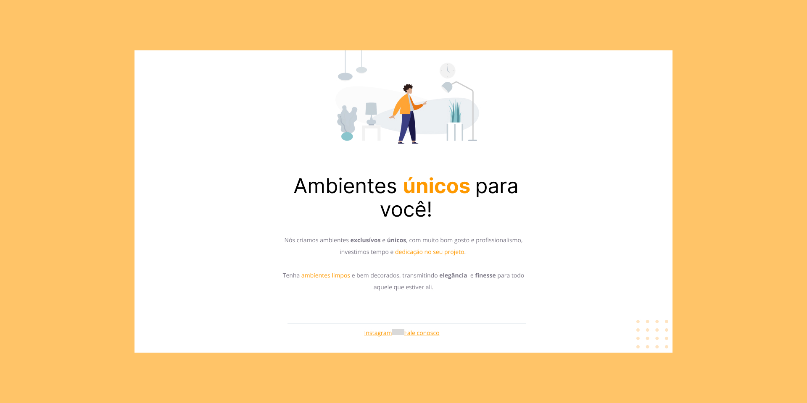

 
<h1 align="center"> Treine.me - HTML&CSS</h1>
 

  

 

<h2>💻 Overview</h2>
 

It's an exercise to practice HTML and some CSS attributes

<a href="https://jefmaeda.github.io/Moveis-customizados/" target="_blank">Here you can check the project online</a>
 

 
<h2>🦾  Update</h2>

 
<h2> 🚀 Technologies</h2>
 

Techs used to build this project:

  <!-- HTML5 -->
  
  <!-- CSS3 -->
  

  <!-- JavaScript -->
  <!--  -->

  <!-- React Native -->
  <!--  -->

  <!-- ReactJS -->
  <!--  -->

 
 
 

Developed with ♥ by Jef Maeda 
